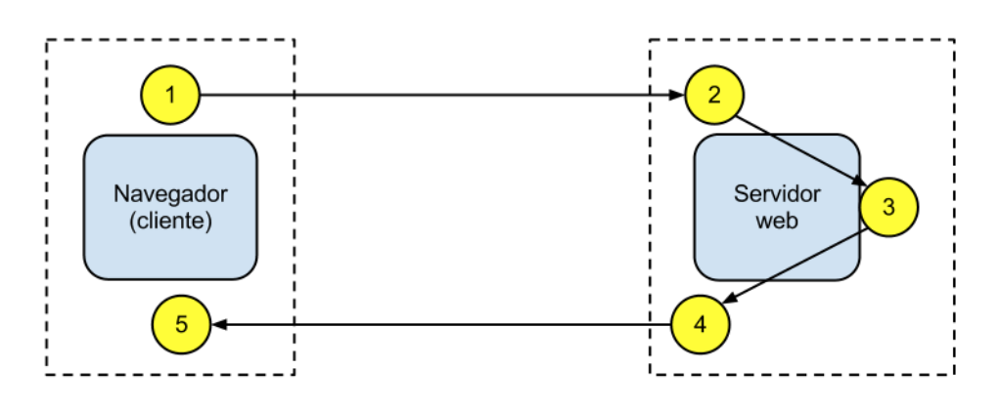

# UT01 Arquitecturas Web

Las arquitecturas web describen la relación entre los distintos elementos que participan en el intercambio/procesamiento de información a través de Internet, así como sus funciones.

La gran mayoría de las arquitecturas web en la actualidad son de tipo cliente-servidor: una comunicación asimétrica en la que uno de los extremos ofrece uno o más servicios y el otro hace uso de ellos. Ésta es la arquitectura sobre la que nos centraremos, aunque existen otras como la Punto a Punto (P2P - Peer to Peer).

## Arquitectura Cliente-Servidor
El modelo cliente-servidor es un modelo que reparte tareas entre los proveedores de un recurso o servicio, llamados **servidores**, y los solicitantes/consumidores del servicio, llamados **clientes**.

Lo más frecuente es que los clientes y los servidores se comuniquen a través de una red de comunicaciones, pero ambos pueden residir en la misma máquina (normalmente en tareas de desarrollo).

El esquema de funcionamiento más básico del modelo cliente-servidor para una arquitectura web está basado en uno o varios clientes que solicitan una página web a un servidor web:

1. Desde el navegador web (o agente de usuario, que puede ser también una app nativa u otro servidor incluso) el usuario solicita un servicio web indicando su URL.
2. El servidor recibe la petición mediante el protocolo de aplicación HTTP, y la procesa mediante su lógica de negocio.
3. Produce una respuesta HTTP a la petición, que envía al cliente. Esta respuesta puede contener ficheros de distinta naturaleza: HTML, CSS, XML, JSON, ficheros multimedia, código JavaScript, etc.
4. El navegador web recibe la información enviada por el servidor y la interpreta. En función de la respuesta enviada, se respresenta en el navegador la respuesta al usuario (normalmente en forma de página web).

A continuación se muestran las ventajas y desventajas al respecto:

Ventajas:

* **Centralización del control:** los accesos, recursos y la integridad de los datos son controlados por el servidor. Esta centralización también facilita la tarea de actualizar datos u otros recursos.
* **Escalabilidad:** se puede aumentar la capacidad de clientes y servidores por separado. Cualquier elemento puede ser aumentado (o mejorado) en cualquier momento, o se pueden añadir nuevos nodos a la red (clientes y/o servidores), siempre que el sistema esté diseñado para ello.
* **Portabilidad:** el hecho de que la aplicación web se ejecute en un navegador web, hace que se independice el software del sistema operativo sobre el que se ejecuta. De esta forma, se aprovecha el desarrollo para las diferentes plataformas.
* **Fácil mantenimiento:** al estar distribuidas las funciones y responsabilidades entre varios ordenadores independientes, es posible reemplazar, reparar, actualizar, o incluso trasladar un servidor, mientras que sus clientes no se verán afectados por ese cambio (o se afectarán mínimamente). Esta independencia de los cambios también se conoce como encapsulación.
* Existen **tecnologías**, suficientemente desarrolladas, diseñadas para el modelo de cliente-servidor que aseguran la seguridad en las transacciones, la usabilidad de la interfaz, y la facilidad de uso.

Desventajas:

* La **congestión** del tráfico ha sido siempre un problema en esta arquitectura. Cuando una gran cantidad de clientes envían peticiones simultáneas al mismo servidor, se pueden producir situaciones de sobrecarga.
* Cuando un servidor está caído, las peticiones de los clientes no pueden ser satisfechas, ya que los recursos no están distribuidos.
* El software y el hardware de un servidor son generalmente muy determinantes. Normalmente se necesita software y hardware específico, dependiendo del tipo de servicio web, sobre todo en el lado del servidor. Esto aumentará el coste. Como alternativa, se dispone de servicios web en la nube, con diversos tipos de costes dependientes de la arquitectura web.

 ***NOTA***: estas desventajas se refieren al caso en que los recursos del servidor no están replicados y/o distribuidos. Actualmente existen técnicas de escalado horizontal y vertical que pueden subsanar estos problemas.

#### Ejemplo Práctico 1: Peticiones desde el navegador
En este apartado vamos a tratar de indagar un poco más en qué sucede detrás de las cortinas cuando consultamos una URL. Vamos a observar, a través de las herramientas de desarrollador del navegador web de Chrome (igual nos puede servir Firefox o cualquier otro), los 4 pasos que se detallaban en el apartado anterior.

Para ello vamos a utilizar la página web del Campus Virtual FP (www.campusvirtualfp.com).

1. Abrimos una pestaña del navegador web e introducimos la URL www.campusvirtualfp.com
A continuación abrimos las herramientas de desarrollador y vamos a la pestaña Network (o Red):

En estos momentos aún no hay datos, porque no hemos hecho una petición al servidor con la ventana de herramientas de desarrollador activa. Por tanto, refrescamos la página (equivalente a hacer una petición al servidor que gestiona www.elche.es) y pasamos al punto siguiente.

El servidor recibe la petición mediante el protocolo de aplicación HTTP, y la procesa mediante su lógica de negocio.
Realmente no podemos saber exactamente qué está sucediendo en el servidor durante este paso, a no ser que tuviésemos acceso al mismo, con los privilegios y herramientas correctas, pero sí podemos averiguar muchos datos mediante herramientas como:

* **whois:** nos indica, entre otros datos, que la IP del servidor es 217.13.88.8 (registro DNS de tipo A).
* **builtwith:** nos indica, entre otras cosas, que la plataforma web dispone de dos servidores web (Apache y nginx).

 ***OJO:*** Existe otro tipo de métodos para conocer más datos sobre el servidor podría implicar prácticas ilegales, en el ámbito de la ciberseguridad.

Este paso se llevaría a cabo en lo que se denomina Back-end.

Vamos a ver el resultado en el siguiente paso.

El servidor produce una respuesta a la petición del cliente, que la envía a través de internet y recupera nuestro navegador.
Ahora, si consultamos la pestaña Network después de refrescar la URL, podremos ver que han aparecido muchos registros, el primero de los cuales tiene como nombre www.elche.es: